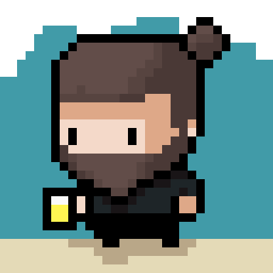
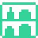
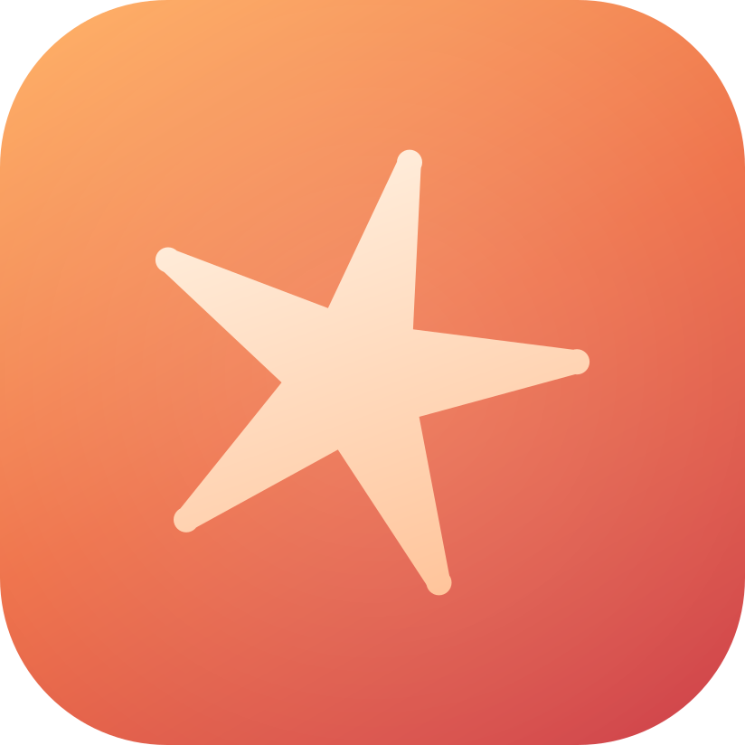
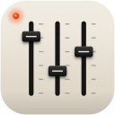
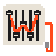

Software developer in Berlin. I build small, polished apps: **Despensado** for iOS and Android, **ClaudioStat**, **BeeHan Brightness** and **TheeJ** for macOS, and **WeeJ** and **Wrecktangle** for Windows.

My first program was an mIRC script that mapped hotkeys to funny messages. 15+ years later I still write code for fun, mostly web and mobile, lately with a lot of AI. Seven of those years went into React Native apps.

### What I've shipped

<table>
<tr>
<td width="56" valign="top"></td>
<td><b><a href="https://appdespensado.zolfer.com">Despensado</a></b> · iOS and Android · <a href="https://apps.apple.com/us/app/despensado/id6806343938">App Store</a> · Google Play soon
 Scan groceries by barcode, get warned before anything expires, share one pantry with your household. In nine languages.</td>
<td></td>
<td></td>
</tr>
<tr>
<td width="56" valign="top"></td>
<td><b><a href="https://claudiostat.zolfer.com">ClaudioStat</a></b> · macOS Your Claude plan limits, live in the menu bar. A refresh costs zero tokens.</td>
<td></td>
<td width="96" valign="top">Open source <a href="https://github.com/zolferfigueiredo/claudiostat">GitHub</a></td>
</tr>
<tr>
<td width="56" valign="top"></td>
<td><b><a href="https://bhb.zolfer.com">BeeHan Brightness</a></b> · macOS 16 brightness steps below the lowest one macOS allows, on the same keys, with the native HUD.</td>
<td></td>
<td width="96" valign="top">Open source <a href="https://github.com/zolferfigueiredo/bhbrightness">GitHub</a></td>
</tr>
<tr>
<td width="56" valign="top"></td>
<td><b><a href="https://theej.zolfer.com">TheeJ</a></b> · macOS Real knobs for your Mac: a deej Arduino mixer for volume, display brightness and keyboard backlight.</td>
<td width="88" valign="top">Inspired <a href="https://github.com/omriharel/deej">deej</a></td>
<td width="96" valign="top">Open source <a href="https://github.com/zolferfigueiredo/theej">GitHub</a></td>
</tr>
<tr>
<td width="56" valign="top"></td>
<td><b><a href="https://weej.zolfer.com">WeeJ</a></b> · Windows Real knobs for your PC: the Windows client for a deej mixer. Each knob sets a volume, a screen's brightness, Night light or a keyboard backlight.</td>
<td width="88" valign="top">Inspired <a href="https://github.com/omriharel/deej">deej</a></td>
<td width="96" valign="top">Open source <a href="https://github.com/zolferfigueiredo/weej">GitHub</a></td>
</tr>
<tr>
<td width="56" valign="top"></td>
<td><b><a href="https://wrecktangle.zolfer.com">Wrecktangle</a></b> · Windows A Rectangle-style window manager. Snap the focused window to a half, a corner or the center with one shortcut.</td>
<td width="88" valign="top">Inspired <a href="https://rectangleapp.com">Rectangle</a></td>
<td width="96" valign="top">Open source <a href="https://github.com/zolferfigueiredo/wrecktangle">GitHub</a></td>
</tr>
<tr>
<td width="56" valign="top"><a href="https://url.zolfer.com"><picture><source media="(prefers-color-scheme: dark)" srcset="https://raw.githubusercontent.com/zolferfigueiredo/zolferfigueiredo/main/assets/project-url.svg"></picture></a></td>
<td><b><a href="https://url.zolfer.com">url.zolfer.com</a></b> · Web Paste a long link, get a short one and a QR code.</td>
<td></td>
<td></td>
</tr>
<tr>
<td width="56" valign="top"></td>
<td><b><a href="https://zolfer.com">zolfer.com</a></b> · Web My pixel-art portfolio, designed by <a href="https://charleneperuchi.com/">Charlene Peruchi</a>.</td>
<td></td>
<td></td>
</tr>
</table>

**Coming soon:** [Celia](https://appcelia.zolfer.com/?lang=en), care for someone you love organized in one place, and [myfood.lv](https://myfood.lv), local food straight from Latvian farmers.

Day to day: TypeScript, React Native, Node and PHP, on MySQL or PostgreSQL.

[zolfer.com](https://zolfer.com) · [LinkedIn](https://www.linkedin.com/in/zolfer/)
